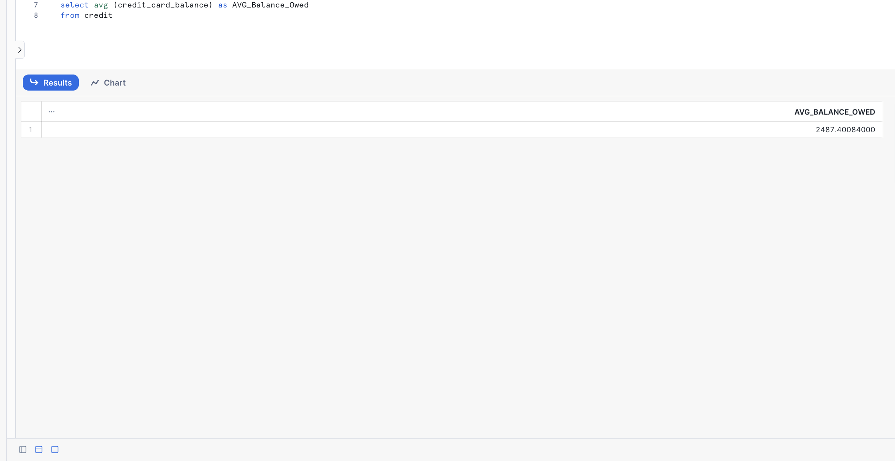
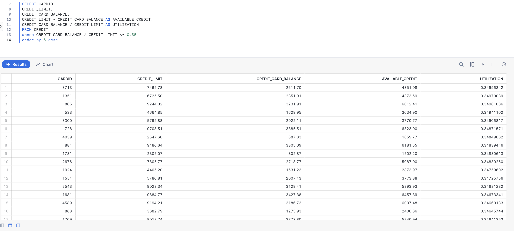
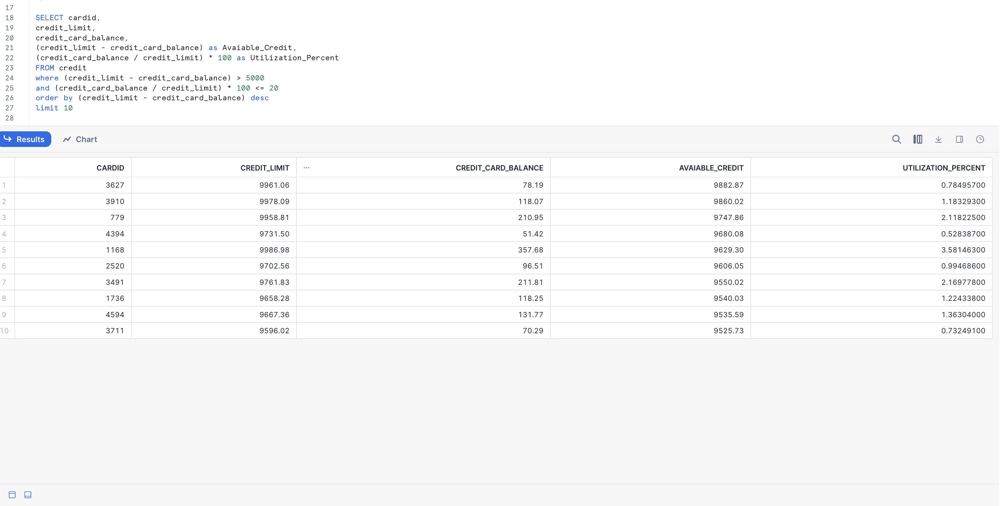

# Banking Data Analytics (Snowflake SQL)

## 📌 Project Overview

This project analyzes anonymized credit data using Snowflake SQL to evaluate customer credit behavior, utilization risk, and expansion opportunities.

The objective was to simulate real-world financial analysis used in credit risk and portfolio management.

---

# 🎯 Analysis 1: Average Credit Card Balance

**Business Question**  
What is the average credit card balance owed by customers?

**Purpose**  
Understand overall portfolio exposure and average customer debt level.

---

# 🎯 Analysis 2: Credit Utilization Overview

**Business Objective**  
Analyze credit utilization rates to evaluate customer risk exposure.

**What Was Calculated**
- Utilization rate for all customers
- Identified customers with utilization ≤ 35%

**Insight**  
Customers with lower utilization rates represent lower credit risk and stronger repayment capacity.

---

# 🎯 Analysis 3: High Available Credit & Low Utilization

**Business Question**  
Which customers have more than $5,000 available credit and utilization ≤ 20%?

**Purpose**
Identify low-risk customers with strong credit capacity who may qualify for credit line increases or premium offers.

**Key Insight**  
Customers with high available credit and low utilization represent high-quality expansion opportunities with minimal risk exposure.

---

# 🛠 SQL Skills Demonstrated

- Aggregations (AVG)
- Derived metrics (available credit & utilization rate)
- Filtering with WHERE
- Multi-condition logic
- Sorting & ranking (ORDER BY, LIMIT)
- Financial risk interpretation

---

# 💻 Tools Used

- Snowflake
- SQL
- GitHub

---

